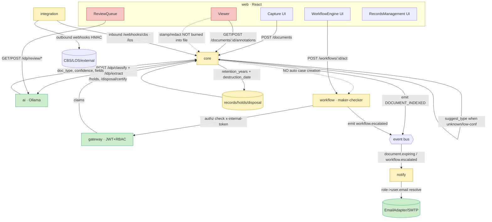

# ZorDMS — System Wiring & Implementation Roadmap

**Date:** 2026-06-25
**Status:** Authoritative synthesis of subsystem audits
**Branch:** amit_local

> **Evidence note.** The 8 per-subsystem `audit-*.md` files referenced by the
> orchestration brief were **not present on disk** at synthesis time. This
> document is therefore grounded directly in the **live codebase**
> (`services/*`, `apps/web/*`, `packages/*`) plus the existing subsystem
> review/report ledger in `.superpowers/sdd/` (`review-*.md`, `wf2/wf5/wf6/wf7-*`,
> `uifix-*`, `progress.md`). Every status below cites a concrete file/line as
> evidence rather than a now-fixed historical review finding. The 8 brief topics
> map onto the sections as: workflow-review → §3a; doctype-metadata-ai → §3b;
> viewer-stamp → §3a; retention-lifecycle → §2 (Records); integration-cbs-los →
> §3d; notify-email-users → §3c; scale-queue-openapi → §3e/§3f; ui-action-buttons → §3g.

---

## 1. Master Interconnection Diagram

### 1.1 Services

`gateway` (4000, identity/RBAC authority, JWT mint w/ claims) ·
`core` (4001, documents/folders/catalog/extract/records/annotations) ·
`workflow` (4002, maker-checker engine + SLA) ·
`notify` (alerts/channels) ·
`search` · `integration` (CBS/LOS connectors + webhooks) ·
`ai` (FastAPI/Ollama IDP: classify/extract/copilot/review) ·
`web` (apps/web React, `/svc/<name>` proxy).

### 1.2 Mermaid flowchart



> **Edge legend:** solid arrow = WIRED · dotted arrow = MISSING/DUMMY.
> The two dotted edges are the highest-impact gaps: **Capture→Workflow** (no
> auto case handoff) and **Viewer stamp/redact→file** (overlays are display-only,
> never burned into the stored document).

### 1.3 ASCII fallback — end-to-end document lifecycle chain

```
[Capture/Ingest]  POST /documents .......................... WIRED
       |
       v
[IDP classify/extract (Ollama)]  core -> AI /idp/classify,/idp/extract ... WIRED
       |   (ocr-fallback when AI down; AI_BACKEND=auto picks ollama/vllm)
       v
[metadata mapping + completeness/quality]  field_mapper + quality.ts ..... WIRED
       |   score = completeness*40 + confidence*60; review_flag if <50
       v
[doc-type detect / new-type suggest]  suggest_type.ts + doc_type_registry . WIRED
       |
       v
[Workflow (maker-checker)]  POST /workflows/:id/act ........... PARTIAL
       |   X  Capture does NOT auto-create a case  ............ MISSING (handoff)
       v
[Review Queue (claim/approve/stamp)]  ReviewQueue -> AI /idp/review/* .. PARTIAL
       |   X  3 disjoint review systems (AI review / workflow act / core);
       |       no claim endpoint in workflow; no stamp from queue
       v
[Viewer (preview/stamp/redact/approve)]  annotations persisted as rows .. PARTIAL
       |   X  stamp/redact are overlays only; never flattened into file;
       |       no "approve from viewer" action wired
       v
[Records / Retention / Legal-hold]  records.ts holds+disposal ........... PARTIAL
       |   retention_years/destruction_date computed; holds/disposal routes
       |   exist; X  no scheduled disposal job / hold-blocks-delete enforcement
       v
[Integration Hub (CBS/LOS, webhooks)]  inbound+outbound webhooks ........ PARTIAL
       |   inbound /webhooks/cbs,/los (HMAC verify) + outbound HMAC dispatch
       |   exist; CBS/LOS connectors present but HTTP+MOCK only (no live core wiring)
       v
[Notifications / Email]  notify consumer -> EmailAdapter ................. PARTIAL
           role->user.email resolution exists (escalation.ts) but the main
           consumer path passes role-NAME strings, not resolved emails
```

---

## 2. Point-wise Wiring Status Table

| # | Capability | Status | Evidence (file) | Gap |
|---|---|---|---|---|
| 1 | Capture/ingest upload | WIRED | `apps/web/.../Capture.tsx` → `POST /documents`; `repositoryViewerApi.uploadDocument` | none |
| 2 | IDP classify/extract via Ollama | WIRED | `services/core/src/ai/client.ts` → AI `/idp/classify`,`/idp/extract`; `services/ai/.../ollama_adapter.py` | live model pull required (`qwen2.5vl:7b`, `granite3.3:8b`) |
| 3 | AI graceful degradation | WIRED | `routes/extraction.ts` `source:"ocr-fallback"` on AI down | none |
| 4 | Field mapping → columns/metadata | WIRED | `services/core/src/ai/field_mapper.ts`; raw union persisted (wf7) | none |
| 5 | Completeness / quality scoring | WIRED | `services/core/src/catalog/quality.ts`; score=compl*40+conf*60 | none |
| 6 | New doc-type suggestion | WIRED | `services/core/src/ai/suggest_type.ts`; unknown/conf<0.4 | suggestion is **not** persisted to registry; no admin "accept" flow |
| 7 | Doc-type registry / mandatory+optional fields | WIRED | `routes/doc_types.ts`; `doc_type_registry` table (25 seeded) | no **admin CRUD UI** to add/edit types or per-type fields |
| 8 | AI sample-based field detection (learn fields from a sample doc) | MISSING | only fixed `MANDATORY`/`PER_TYPE_OPTIONAL_FIELDS` maps in code | no endpoint to infer a field schema from an uploaded sample |
| 9 | Dedup / auto-version config | WIRED | `routes/dedup_config.ts`; `dedup_config` table; `repo/duplicates.ts` | none |
| 10 | Capture → Workflow case handoff | MISSING | `routes/extraction.ts` emits `DOCUMENT_INDEXED` only; no `POST /cases` call | low-conf docs never enter maker-checker automatically |
| 11 | Workflow maker-checker `/act` | PARTIAL | `services/workflow/src/routes/workflows.ts:230` `/:id/act` (auth+authority wired) | no **claim** endpoint; OnHold/Escalated re-act guard (historical F4) |
| 12 | Review Queue (claim/approve) | PARTIAL | `apps/web/.../ReviewQueue.tsx` → AI `/idp/review/*` (`api/aiEngine.ts:133`) | review queue lives in **AI service**, disjoint from workflow `/act` & core |
| 13 | Viewer preview (image/PDF, zoom/rotate) | WIRED | `apps/web/.../Viewer.tsx`, `FullScreenPreview.tsx` | none |
| 14 | Viewer annotation persistence | WIRED | `routes/annotations.ts`; `repo/annotations.ts`; branch-scoped | none |
| 15 | Stamp / redact burned into file | MISSING | `Viewer.tsx` stamp/redact are SVG overlays only; `services/sign.js` standalone, unwired | no flatten/sign endpoint in core; redaction not destructive |
| 16 | "Approve from Viewer" → workflow | MISSING | no approve action / workflow call in `Viewer.tsx` | viewer is read+annotate only |
| 17 | URL-based navigation / deep-link to doc | PARTIAL | `useUrlState` hook + url filters (wf3); Viewer uses `useParams` | no "open in viewer" deep-link from ReviewQueue/Workflow rows |
| 18 | Retention years + destruction date | WIRED | `routes/catalog.ts:36`, `routes/extraction.ts:230` | none |
| 19 | Legal hold place/release | PARTIAL | `routes/records.ts:26,35` `/holds`,`/holds/:ref/release` | hold does **not** block delete/disposal; no enforcement check |
| 20 | Disposal eligibility + certify | PARTIAL | `routes/records.ts:42,49` | no **scheduled** disposal job; manual-only |
| 21 | User table email column | WIRED (schema) | `core/src/migrations/...identity_rbac.ts:9` `t.string("email",200)` | column exists; **seed population unverified**; gateway is identity authority but DB-per-service |
| 22 | Role/group → user targeting | PARTIAL | `notify/src/services/escalation.ts:15-27` resolves role→user.email | main `consumer.ts`→`ruleEngine` emits role-NAME strings, not resolved users |
| 23 | Email notifications | PARTIAL | `notify/src/channels/email.ts` (`EmailAdapter`); SMTP in `registry.ts` | jsonTransport fallback when no `SMTP_HOST`; recipient resolution not in main path (#22) |
| 24 | Notify expiry scan scheduled | WIRED | `notify/src/jobs/expiryScan.ts` | confirm cron/interval wired in `server.ts` at deploy |
| 25 | Integration inbound webhooks (CBS/LOS) | WIRED | `integration/src/routes/webhooks.ts:51,55` `/cbs/customer-updated`,`/los/loan-application` + HMAC verify | inbound events not yet **consumed by core** (no doc/customer upsert) |
| 26 | Integration outbound webhooks | WIRED | `integration/src/routes/outbound.ts`; `webhooks/dispatch.ts` HMAC | none |
| 27 | CBS/LOS/KYC connectors | PARTIAL/DUMMY | `integration/src/adapters/{cbs,los,kyc}.ts`; `connectors/{http,mock}.ts` | HTTP connector generic; **mock** is default; no live base-URL wiring to core flows |
| 28 | OpenAPI specs | MISSING | no `openapi.*` file anywhere; only design `.md` in `docs/superpowers/specs` | no machine contract for any service |
| 29 | Boundary schema validation | PARTIAL | `core/src/schemas/index.ts` (zod) in core only | no zod/validation at workflow/notify/integration/search boundaries |
| 30 | Durable queue / background processing | PARTIAL | `core/src/events/index.ts`: `RedisStreamsEventBus` exists, `InMemoryEventBus` default | no BullMQ-style worker, retries, DLQ; extract runs inline in request |
| 31 | Payload preservation at scale | PARTIAL | events carry payload to Redis stream | no replay/ack/at-least-once consumer; lost if Redis absent |
| 32 | Action-button styling consistency | PARTIAL | shell de-button done (`wf1-shell-report.md`); `uifix-workflow.md C1` RBAC-gated | residual inconsistent icon/action-button styling across screens (quick win) |
| 33 | AD/LDAP/SSO | DEFERRED | `services/saml.js` legacy stub only | **explicitly out of scope now** — later track |

---

## 3. Key Gaps by Theme

### (a) Workflow / Review / Viewer wiring + stamping + URL-nav
- **Three disjoint review systems.** ReviewQueue calls **AI** `/idp/review/*`
  (#12), the WorkflowEngine UI calls **workflow** `/workflows/:id/act` (#11),
  and core has its own catalog routing. They do not share state. A document
  flagged `review_flag` in core/AI does not create a workflow case (#10).
- **No claim in workflow service** (#11) — claim lives only in the AI review queue.
- **Stamp/redact are cosmetic** (#15): annotations persist as DB rows and render
  as overlays in `Viewer.tsx`, but are never flattened/burned into the stored
  file. Redaction is therefore reversible/non-destructive — a compliance risk.
  Legacy `services/sign.js` (pdf-lib) is unwired.
- **No "approve from viewer"** (#16) and **no deep-link** from a queue/workflow
  row into the Viewer at the right doc/page (#17).

### (b) Doc-type / metadata admin + AI sample-based field detection
- Registry, mandatory/optional fields, quality scoring, and new-type
  *suggestion* are all WIRED (#5–#9), but **suggestions are not persisted** and
  there is **no admin CRUD UI** to manage doc types or per-type field schemas (#7).
- **No AI sample-based field detection** (#8): field schemas are hardcoded maps
  (`catalog/engine.ts`, `quality.ts`); the system cannot infer a field set from
  an uploaded sample document.

### (c) User-table email + role/group targeting + email notifications
- `users.email` column exists (#21); **seed population unverified** and identity
  is gateway-owned under DB-per-service, so notify must resolve emails from a
  reachable user store.
- `escalation.ts` *can* resolve role→user→email (#22), but the **main consumer
  path** (`consumer.ts`→`ruleEngine.ts`) emits role-NAME strings as recipients,
  so EmailAdapter has no concrete address in the common flow.
- EmailAdapter + SMTP transport WIRED (#23) but falls back to `jsonTransport`
  (no real send) when `SMTP_HOST` is unset.

### (d) Integration CBS/LOS inbound/outbound + webhooks
- Inbound `/webhooks/cbs/*`, `/webhooks/los/*` with HMAC verification (#25) and
  HMAC outbound dispatch (#26) are WIRED at the integration boundary.
- **Inbound events are not consumed by core** (#25) — a CBS customer-updated or
  LOS loan-created event does not yet upsert a customer/document.
- CBS/LOS/KYC **connectors default to mock** (#27); no live base-URL wiring.

### (e) OpenAPI specs + boundary schema validation
- **No OpenAPI** for any service (#28) — no machine-readable contract.
- zod validation exists **only in core** (#29); workflow/notify/integration/
  search accept request bodies without schema validation at the boundary.

### (f) Durable queue / background processing / payload preservation at scale
- `RedisStreamsEventBus` exists but **`InMemoryEventBus` is the default** (#30);
  extraction runs **inline in the request**, not on a worker.
- No retries / ack / dead-letter / replay → **at-most-once** delivery; events are
  lost when Redis is absent (#31). This is the main scale risk.

### (g) Action-button styling fix (quick win)
- Shell de-button + RBAC gating landed (#32); residual **inconsistent icon/action
  button styling** remains across list/detail screens. Pure CSS/className pass.

### (Deferred) AD/LDAP/SSO
- **Not planned in this roadmap** (#33). Later track only; `services/saml.js`
  stub is a placeholder, do not build on it now.

---

## 4. Prioritized Implementation Roadmap

Phases are ordered; each is independently shippable. Size: S<1d, M 1–3d, L >3d.

| Phase | Name | Scope / touches | Size |
|---|---|---|---|
| **P0** | **Action-button styling pass** | `apps/web/src/components/ui/*`, page action columns (`ReviewQueue.tsx`, `Viewer.tsx`, `Workflow*`, `Repository.tsx`); shared `.btn`/icon-button classes in `theme.css` | **S** |
| **P1** | **user.email seed + verify** | `services/core/src/seeds/0001_core_rbac.ts` (+gateway seed); backfill email for all seeded users; assert non-null in a test | **S** |
| **P2** | **Notify recipient resolution → real email** | wire `ruleEngine`/`consumer.ts` to `escalation.ts` role→user.email resolution; ensure EmailAdapter receives addresses; document `SMTP_HOST` for real send | **M** |
| **P3** | **Capture → Workflow handoff** | `services/core/src/routes/extraction.ts` (auto `POST /cases` to workflow when `review_flag`/low quality); workflow `routes/cases.ts`; add **claim** endpoint to workflow; ReviewQueue → workflow source of truth | **L** |
| **P4** | **Viewer stamp/redact burn + approve** | core: new `POST /documents/:id/stamp` + `/redact` using pdf-lib (reuse `services/sign.js` logic), destructive redaction, new version; `Viewer.tsx` approve action → workflow `/act`; deep-link from queue rows | **L** |
| **P5** | **Doc-type/metadata admin + persist suggestions** | core `routes/doc_types.ts` (CRUD + per-type fields), `suggest_type.ts` persist-on-accept; new admin screen `apps/web/.../SystemAdministration` | **M** |
| **P6** | **AI sample-based field detection** | ai: new `/idp/infer-fields` (Ollama prompt over sample); core route to apply inferred schema to a doc type; UI in P5 admin screen | **L** |
| **P7** | **Integration inbound consumption + live connectors** | core consumes integration CBS/LOS inbound events (customer/doc upsert); wire `adapters/{cbs,los,kyc}.ts` to live base-URLs via env (mock fallback retained) | **M** |
| **P8** | **Durable queue + background extraction** | swap default to `RedisStreamsEventBus`; add BullMQ worker for extraction (move inline extract off request path); retries + DLQ + ack; `services/core/src/events/*`, new `workers/` | **L** |
| **P9** | **Records lifecycle enforcement** | `routes/records.ts`: legal-hold blocks delete/disposal; scheduled disposal-eligibility job | **M** |
| **P10** | **OpenAPI specs + boundary validation** | generate OpenAPI per service (zod-to-openapi in core; add zod at workflow/notify/integration/search boundaries); publish specs under `docs/superpowers/specs/openapi/` | **M** |
| **—** | *(Deferred)* AD/LDAP/SSO | later track — not scheduled | — |

**Rationale for order:** P0/P1 are zero-risk quick wins. P2 makes notifications
actually deliver. P3/P4 close the highest-impact lifecycle gaps (handoff +
real stamping/approval) that the diagram marks dotted. P5/P6 deliver the
doc-type/AI admin value. P7 makes integration two-way. P8 is the scale
foundation. P9/P10 harden compliance + contracts.

---

*Source files cited inline are authoritative as of branch `amit_local`,
post-UUID-migration Phase 2.*
